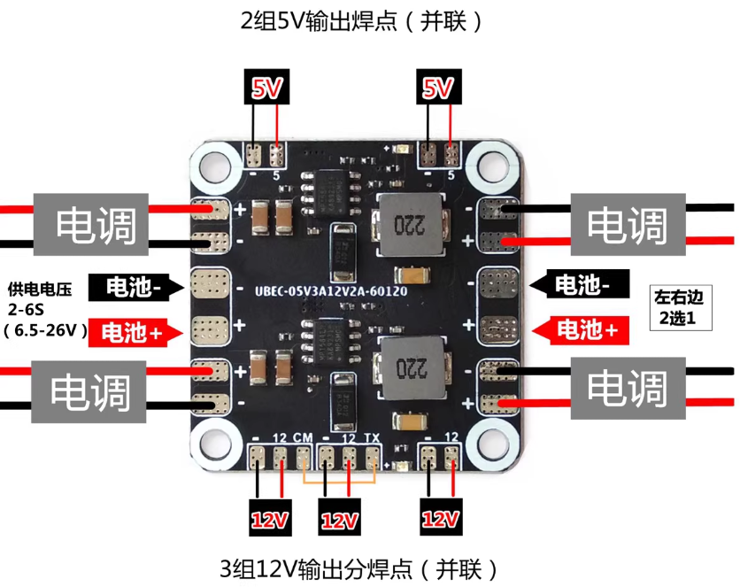
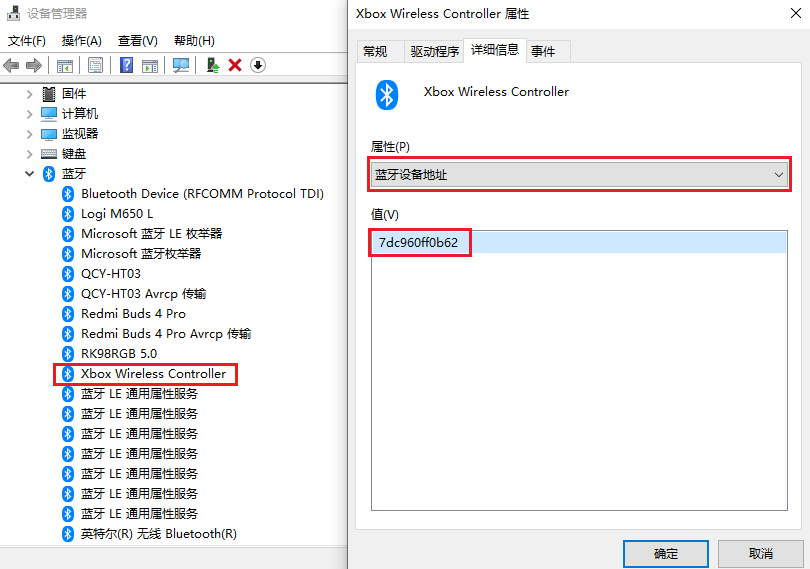
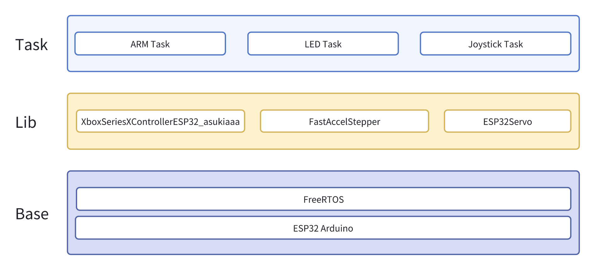
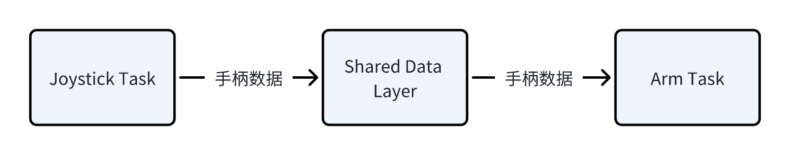
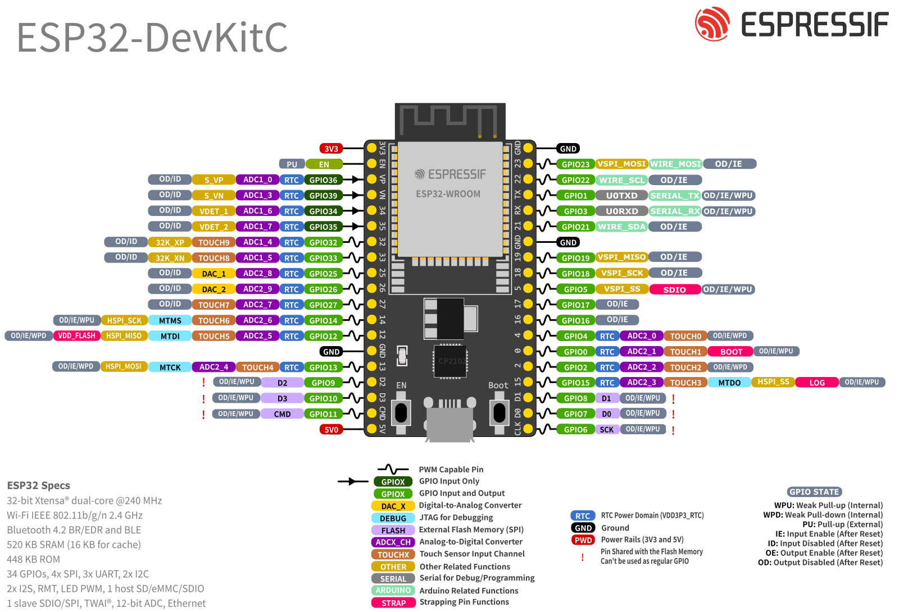

  <h1>Mini_Arm</h1>
  
这是一个适用于T站五轴机械臂<a href='https://www.thingiverse.com/thing:1748596'>Robotic arm</a>的电控方案。基于ESP32构建，使用支持Xbox协议的控制器通过摇杆控制机械臂。该系统采用 FreeRTOS 任务编排，在 ESP32 的双核架构上协调输入处理、运动控制和状态指示。

# 实物演示

# 操作逻辑

|  手柄通道  |   功能   |
| :--------: | :------: |
|     X      | 无力模式 |
|     Y      |  初始化  |
| 左摇杆左右 |  关节1   |
| 左摇杆前后 |  关节2   |
| 右摇杆左右 |  关节3   |
| 右摇杆前后 |  关节4   |
| 方向键左右 |  关节5   |
|  左右扳机  |   工具   |

# 开发环境

- Visual Studio Code 1.101.1

- PlatformIO IDE 3.3.4

# 硬件选型

- 开发板：NodeMCU-32，核心为ESP32

- 舵机：MG996（180度）

- 步进电机：42步进电机37mm高

- 步进电机驱动：[A4988](https://e.tb.cn/h.h3TTC49Cdaz16WK?tk=qnp6VEmXCS6)

- 电源模块：[250穿越机降压分电板](https://e.tb.cn/h.h3TXWC9Uwz5cGjr?tk=yw3jVEOzgk2)

- 电位器：3590S-2-503L

- 手柄：盖世小鸡启明星

- 电池：DJI TB47D

## 电源选型

250穿越机降压分电板支持6.5-26V输入，电池电压、12V、5V输出，要获得稳定12V输出时需选用至少4S电池。本项目中使用了24V的DJI经纬M100的TB47D电池。

下图中的电调焊盘与电池焊盘是并联关系，12V或电调输出端可以供给步进电机驱动器使用，5V可供给所有舵机和MCU使用。

模块为两路降压电路并联，当其中一路电路损坏时，电流可能不足以驱动所有舵机，需要更换整个模块。

# 硬件连线

| 信号          | 信号    |
| ------------- | ------- |
| 关节1步进方向 | GPIO 15 |
| 关节1步进信号 | GPIO 2  |
| 关节1步进使能 | GPIO 0  |
| 关节2正向舵机 | GPIO 19 |
| 关节2反向舵机 | GPIO 18 |
| 关节3舵机     | GPIO 5  |
| 关节4舵机     | GPIO 17 |
| 关节5舵机     | GPIO 16 |
| 工具舵机      | GPIO 4  |

实物连线图：

# 手柄连接

大部分支持Xbox协议的手柄都能通过蓝牙连接ESP32。按照以下步骤配置完MAC地址后ESP32即可自动连接上手柄

## 替换地址

1. 用电脑蓝牙连接手柄
2. 打开设备管理器，找到：蓝牙->Xbox Wireless controller->双击打开->详细信息->属性栏下拉->找到“蓝牙设备地址”->得到地址
3. 把地址替换到代码对应位置`./src/joystick_task.cpp` `xboxController = XboxSeriesXControllerESP32_asukiaaa::Core("7d:c9:60:ff:0b:62");`

## 连接到ESP32

把代码烧录到开发板后，首次连接手柄的时候需要让手柄进入配对模式（小鸡启明星是同时长按LOGO键和LOGO键正下方的键，Xbox是长按LOGO键），这时通常指示灯会快闪，等待与ESP32配对成功后指示灯常亮，成功后第二次就可以直接连了。如果手柄在配对模式长时间连接不上，可以按一下开发板的RESET。

# 系统架构

本程序在软件方面的架构分为三层，底层采用集成FreeRTOS的ESP32 Arduino框架，库依赖采用了三个通过PlatformIO管理的外部库，用于驱动Xbox手柄、步进电机、舵机，顶层的三个任务分别控制机械臂运动、LED指示、摇杆数据处理。

## 任务配置

ESP32是具有两个核心的单片机，可以真正意义上实现双线程并行。FastAccelStepper库可以实现对步进电机的非阻塞式控制，即调用步进电机的运动函数后，代码可以继续向下执行，无需等待步进电机运动到指定位置。实现原理是创建一个RTOS任务，在每次任务运行时对步进电机进行控制，而非在运动函数中直接控制电机运行。Arm Task在调用`engine.init(0)`初始化时会创建一个名为`StepperTask`的任务。为确保步进电机平稳运行，将步进电机任务配置在核心0，其它任务配置在核心1。

因步进电机引脚占用了LED引脚，禁用了LED任务的运行。

| 任务          | 堆栈大小 | 优先级 | 核心 | 状态 | 用途               |
| ------------- | -------- | ------ | ---- | ---- | ------------------ |
| Arm Task      | 2048     | 1      | 1    | 启用 | 机械臂运动控制     |
| Joystick Task | 4096     | 1      | 1    | 启用 | 摇杆数据接收和处理 |
| Led Task      | 1024     | 1      | 1    | 禁用 | 指示机械臂状态     |
| Stepper Task  | 2000     | 25     | 0    | 启用 | 驱动步进电机       |

## 共享数据管理架构

系统使用FreeRTOS互斥锁，以协调手柄任务和机械臂控制任务之间线程安全的资源共享。

## 状态管理

代码采用有限状态机来管理系统安全性和运行模式。

| 状态                             | 进入条件                  | 动作                                                         | 退出条件           | 用途                       |
| -------------------------------- | ------------------------- | ------------------------------------------------------------ | ------------------ | -------------------------- |
| 无力模式`ARM_STATE_ZERO_FORCE`   | 系统启动，`btnX`按下      | `disableOutputs()`，所有`servo.detach()`。各个关节可以手动拖动 | `btnY`按下         | 急停或机械臂通电闲置时使用 |
| 初始化模式`ARM_STATE_INITIALIZE` | 从`ZERO_FORCE`+`btnY`开始 | `enableOutputs()`、`servo.attach()`，关节依次运动到初始化位置 | 初始化完成或`btnX` | 开始运行前的初始化         |
| 运行模式`ARM_STATE_RUN`          | 从`INITIALIZE`完成开始    | 持续摇杆处理与关节控制                                       | `btnX`按下         | 运动控制                   |

# 库依赖

项目依赖于三个通过PlatformIO管理的外部库：

- `XboxSeriesXControllerESP32_asukiaaa`：处理Xbox控制器通信
- `ESP32Servo`：为机械臂关节提供舵机控制功能
- `FastAccelStepper`：具有加速度曲线的精确步进电机控制

# 项目结构

## 目录结构概述

本项目遵循标准 PlatformIO 目录结构进行 ESP32 开发

| 目录       | 内容             |
| ---------- | ---------------- |
| `src/`     | 源文件           |
| `include/` | 头文件           |
| `lib/`     | 私有库           |
| `test/`    | 单元测试         |
| `.pio/`    | 编译文件、外部库 |
| `.vscode/` | IDE 配置         |

## 源文件

目录 `src/` 包含核心应用程序组件，按 FreeRTOS 任务和共享数据管理组织：

| 文件                | 核心函数                                    | 用途                        |
| ------------------- | ------------------------------------------- | --------------------------- |
| `main.cpp`          | `setup()`, `loop()`                         | 任务创建和 FreeRTOS 初始化  |
| `joystick_task.cpp` | `JoystickTask_t::run()`                     | Xbox 控制器输入处理         |
| `arm_task.cpp`      | `armTask_t::run()`                          | 机械臂运动控制              |
| `share_data.cpp`    | `updateJoystickData()`, `getJoystickData()` | 线程安全数据共享            |
| `led_task.cpp`      | `LedTask_t::run()`                          | 状态 LED 控制（当前已禁用） |

# 改进方向

- 目前缺乏机械臂的正逆运动学解算，只能单独控制每个关节
- 舵机选用了常见的MG996，价格低廉但背隙较大。选用更精密的数字舵机或将关节连接位置更换为金属件可以提高控制精度
- T站原有方案清单中虽然配备了多圈电位器用于关节1的绝对定位，但本项目并未使用。如需实现对关节1的绝对定位，需要连接电位器并使用ADC进行读取。

# 参考项目

[xiaocainiao11111/ESP32_connect_XboxController: ESP32通过蓝牙连接Xbox手柄读取所有的信号](https://github.com/xiaocainiao11111/ESP32_connect_XboxController)

# 参考文档

[ESP32入门教程](https://mp.weixin.qq.com/mp/appmsgalbum?__biz=MzI1MjM4MzAwNg==&action=getalbum&album_id=2201122277289689089&scene=173&subscene=&sessionid=svr_bb1071732f9&enterid=1750867585&from_msgid=2247484393&from_itemidx=1&count=3&nolastread=1#wechat_redirect)

[FastAccelStepper库文档](https://github.com/gin66/FastAccelStepper)

[FastAccelStepper库AI文档](https://deepwiki.com/gin66/FastAccelStepper)

# AI文档

# 其它

[NodeMCU-32 规格书.pdf](.doc\NodeMCU-32 规格书.pdf) 

开发板管脚布局：

